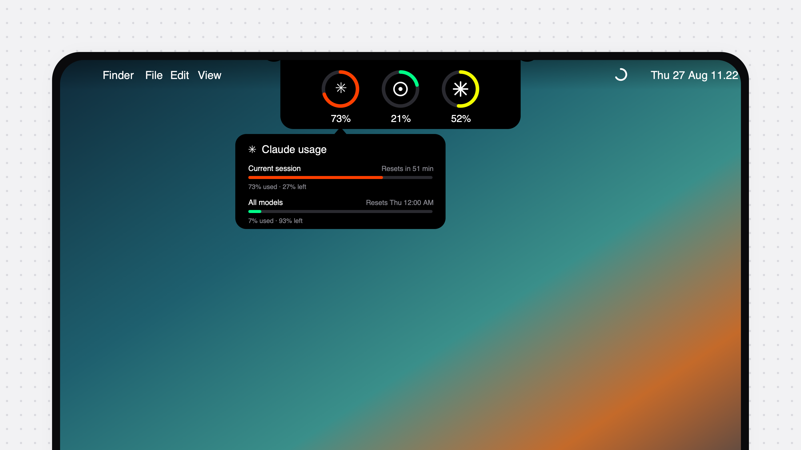

<div align="center">


# Halo

**El notch de tu Mac se convierte en una Dynamic Island para tus asistentes de código.**
Pasa el cursor para ver cuánto de cada límite de uso llevas gastado, cuándo se
renueva, y si un agente sigue trabajando, terminó o está esperándote.


[English](README.md) · [Português](README.pt-BR.md) · **Español**



</div>

Halo es un fork de [Codenotch](https://github.com/vinzdg/codenotch), de Vinz,
reconstruido alrededor de tres ideas:

- **Solo números reales.** Cada porcentaje viene del endpoint oficial de uso
  del proveedor, el mismo que lee el `/usage` de su CLI. Halo nunca estima,
  proyecta ni inventa una ventana que no recibió.
- **El notch es la interfaz.** En reposo no se dibuja nada: el recorte físico
  es Halo. Acércate y crece desde el recorte, como la Dynamic Island del
  iPhone. Sin asas, sin botones flotantes, sin adornos. Pasa el cursor sobre
  un anillo y se abre su informe.
- **Fuera del camino.** Halo vive en la barra de menús, no en el Dock.
  Ajustes y Salir están a un clic del icono de Halo.

## Instalar

[](../../releases/latest/download/Halo.dmg)

El botón es la propia imagen de disco. El archivo se llama `Halo.dmg` en cada
release, así que ese enlace siempre resuelve al más nuevo. Arrastra Halo a
Aplicaciones y quita la marca de cuarentena una vez (la compilación está
firmada ad-hoc, no notarizada):

```sh
xattr -dr com.apple.quarantine /Applications/Halo.app
```

Si macOS dice que la app está *dañada*, es la marca de cuarentena, no una
descarga corrupta. Ejecuta el comando de arriba.

Binario universal. macOS 15 o posterior. Luce mejor en un Mac con notch
físico, donde Halo se funde con él; en cualquier otra pantalla dibuja su
propia píldora en el borde que elijas.

## Qué lee

Halo toma prestada una credencial o sesión de una herramienta que ya está en
tu Mac y consulta el endpoint oficial de uso del proveedor. Nada se copia,
renueva ni escribe de vuelta.

| Proveedor | Fuente |
|---|---|
| **Claude Code** | La caché de uso de Claude Desktop, luego el `/usage` de la CLI `claude`, luego el token OAuth del llavero contra `api.anthropic.com/api/oauth/usage`. Muestra la sesión de 5 horas, la ventana semanal y las ventanas semanales por modelo. |
| **Codex** | El inicio de sesión local de Codex. Límites de 5 horas y semanal, más ventanas extra cuando la cuenta las tiene. |
| **Cursor** | La sesión iniciada del editor, o el inicio de sesión `cursor-agent` del llavero. |
| **Antigravity** | El language server local, luego el endpoint de cuota de Google. |
| **GitHub Copilot** | El endpoint de cuota de Copilot mediante la sesión de la CLI `gh`. |
| **Kimi, Kiro, Grok, OpenCode, Command Code, GLM, MiniMax, DeepSeek, QianwenAI** | La sesión o clave local de cada herramienta, contra su endpoint oficial. |
| **Ollama, LM Studio** | Runtimes locales: modelos cargados, memoria, uso de contexto y velocidad. |

Dos inicios de sesión de Claude Code son dos anillos: cualquier directorio
`~/.claude-<slug>` que Claude Code haya usado recibe su propio anillo. Codex
funciona igual con `~/.codex-<slug>`.

## Sesiones

Un arco fino gira dentro del anillo de un proveedor mientras un agente está
ocupado, y se convierte en un anillo ámbar pulsante cuando uno está bloqueado
esperándote. Pasa el cursor para ver cada sesión activa por nombre y dónde
corre. Cuando una sesión termina o se detiene para preguntarte algo, Halo se
abre cinco segundos y suena la alerta del sistema; al hacer clic trae al
frente la app de esa sesión.

## Ajustes

Desde el icono de la barra de menús, **Ajustes…**:

- **Notch**: qué borde, qué pantalla, y un control deslizante continuo de
  tamaño (60% a 200%) para ajustar el notch abierto a tu pantalla.
- **Cuentas**: qué proveedores se muestran y en qué orden.
- **Notificaciones**: umbrales y alertas de renovación.
- **Teléfono**: empareja la app móvil en la misma red Wi-Fi para ver las
  mismas lecturas allí.

## Compilar

```sh
brew install xcodegen   # una vez
make run                # genera, compila y abre una build de Debug
make test               # pruebas unitarias
make dmg-ci             # imagen de disco sin firmar en build/ci/
```

Se necesita Xcode. No hace falta ninguna identidad de firma.
`Scripts/sign-local.sh` firma la app con una identidad autofirmada estable
para que el "Permitir siempre" del llavero para el token de Claude sobreviva
a las recompilaciones.

Ejecuta con `HALO_DEMO=1` para datos de ejemplo fijos.

## Créditos y licencia

Halo deriva de [Codenotch](https://github.com/vinzdg/codenotch),
Copyright (c) 2026 Vinz, licencia MIT. Los cambios de Halo son
Copyright (c) 2026 Jean Ribas y se publican bajo la misma licencia MIT. Ver
[LICENSE](LICENSE).
