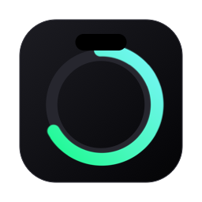

<div align="center">



# Halo

**The notch on your Mac becomes a Dynamic Island for your coding assistants.**
Hover it to see how much of each usage limit you have burned, when it resets,
and whether an agent is still working, done, or waiting on you.


</div>

Halo is a fork of [Codenotch](https://github.com/vinzdg/codenotch) by Vinz,
rebuilt around three ideas:

- **Only real numbers.** Every percentage comes from the provider's own usage
  endpoint, the same one its CLI's `/usage` reads. Halo never estimates,
  paces or invents a window it was not given.
- **The notch is the interface.** At rest, nothing is drawn: the hardware
  notch is Halo. Reach for it and it grows out of the cutout, iPhone Dynamic
  Island style. No floating handles, no orbs, no extra chrome. Hover a ring
  and its report opens.
- **Out of the way.** Halo lives in the menu bar, not the Dock. Settings and
  Quit are one click from the Halo icon.

## Install

[](../../releases/latest/download/Halo.dmg)

The button is the disk image itself. The asset is named `Halo.dmg` in every
release, so that link always resolves to the newest one. Drag Halo to
Applications, then clear the quarantine flag once (the build is ad-hoc
signed, not notarized):

```sh
xattr -dr com.apple.quarantine /Applications/Halo.app
```

If macOS says the app is *damaged*, that is the quarantine flag, not a bad
download. Run the command above.

Universal binary. macOS 15 or later. Best on a Mac with a hardware notch,
where Halo merges with it; on any other display it draws its own pill on the
edge you choose.

## What it reads

Halo borrows a credential or session from a tool already on your Mac and asks
the provider's official usage endpoint. Nothing is copied, refreshed or
written back.

| Provider | Source |
|---|---|
| **Claude Code** | Claude Desktop's cached usage, then the `claude` CLI's own `/usage`, then the OAuth token in the login keychain against `api.anthropic.com/api/oauth/usage`. Shows the 5-hour session, the weekly window and per-model weekly windows. |
| **Codex** | The local Codex sign-in. 5-hour and weekly limits, plus extra windows when the account has them. |
| **Cursor** | The editor's signed-in session, or the `cursor-agent` keychain login. |
| **Antigravity** | The local language server, then Google's quota endpoint. |
| **GitHub Copilot** | GitHub's Copilot quota endpoint via the `gh` CLI session. |
| **Kimi, Kiro, Grok, OpenCode, Command Code, GLM, MiniMax, DeepSeek, QianwenAI** | Each tool's own local session or key, against its official endpoint. |
| **Ollama, LM Studio** | Local runtimes: loaded models, memory, context use and speed. |

Two Claude Code logins are two rings: any `~/.claude-<slug>` directory Claude
Code has run against gets its own ring. Codex works the same way with
`~/.codex-<slug>`.

## Sessions

A thin arc spins inside a provider's ring while an agent is busy, and turns
into a pulsing amber ring when one is blocked waiting on you. Hover for every
live session by name and where it is running. When a session ends or stops to
ask you something, Halo opens for five seconds and sounds the system alert;
clicking it brings that session's app to the front.

## Settings

From the menu bar icon, **Settings…**:

- **Notch**: which edge, which display, and a continuous size slider (60% to
  200%) so the open notch can be matched to your screen.
- **Accounts**: which providers are shown and in what order.
- **Notifications**: thresholds and reset alerts.
- **Phone**: pair the companion phone app on the same Wi-Fi to see the same
  readings there.

## Building

```sh
brew install xcodegen   # once
make run                # generate, build, launch a Debug build
make test               # unit tests
make dmg-ci             # unsigned disk image in build/ci/
```

Xcode is required. No signing identity is needed for any of these.
`Scripts/sign-local.sh` signs the built app with a stable self-signed
identity so the keychain's "Always Allow" for the Claude token sticks
across rebuilds.

Run with `HALO_DEMO=1` or `CODENOTCH_DEMO=1` for fixed sample data.

## Credits and license

Halo is derived from [Codenotch](https://github.com/vinzdg/codenotch),
Copyright (c) 2026 Vinz, MIT License. The Halo changes are Copyright (c) 2026
Jean Ribas and released under the same MIT License. See [LICENSE](LICENSE).
